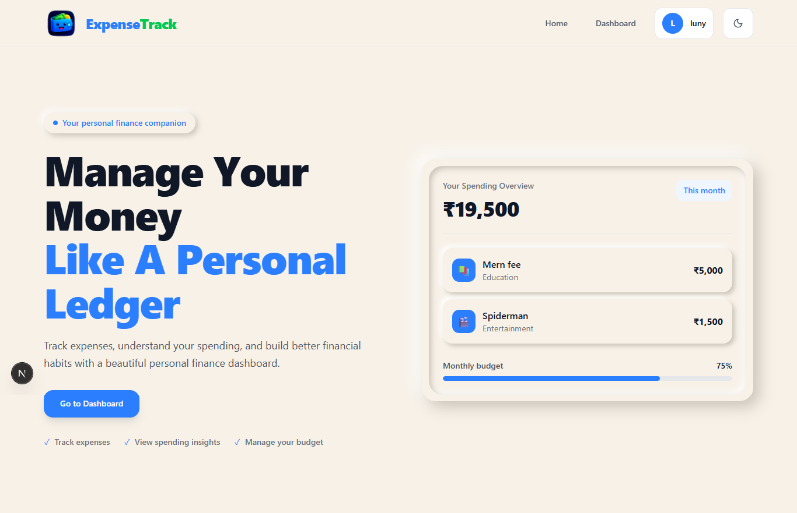
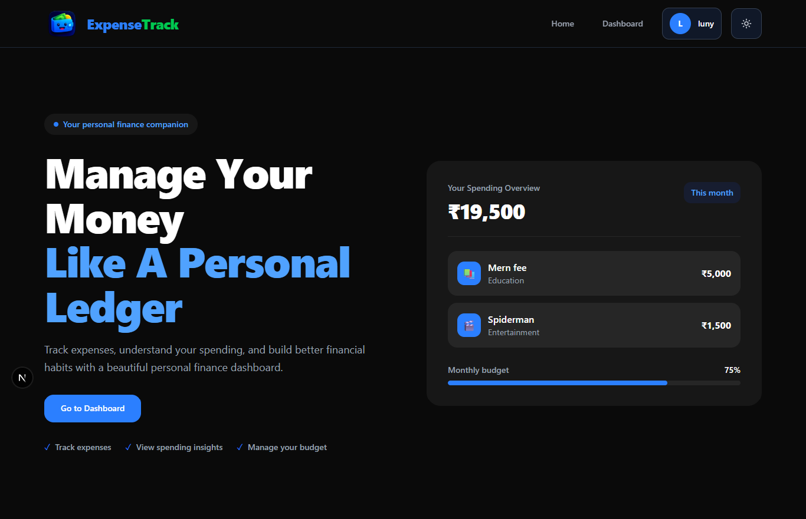
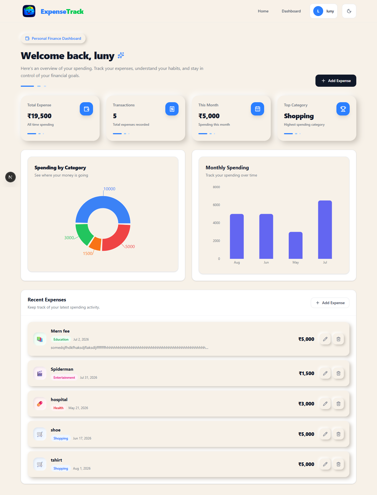
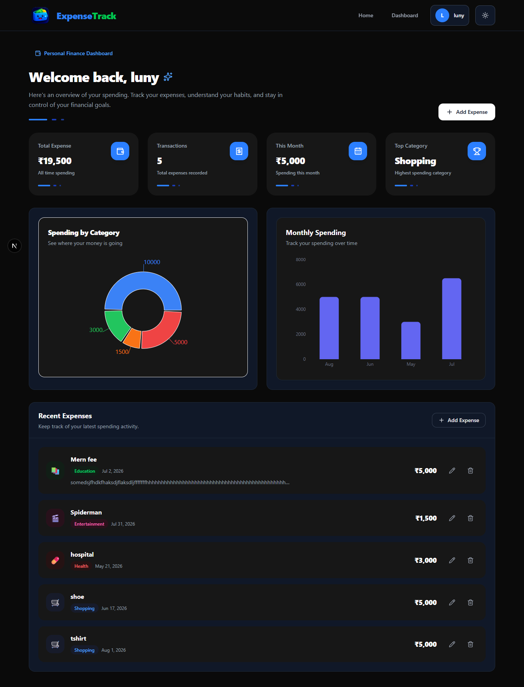
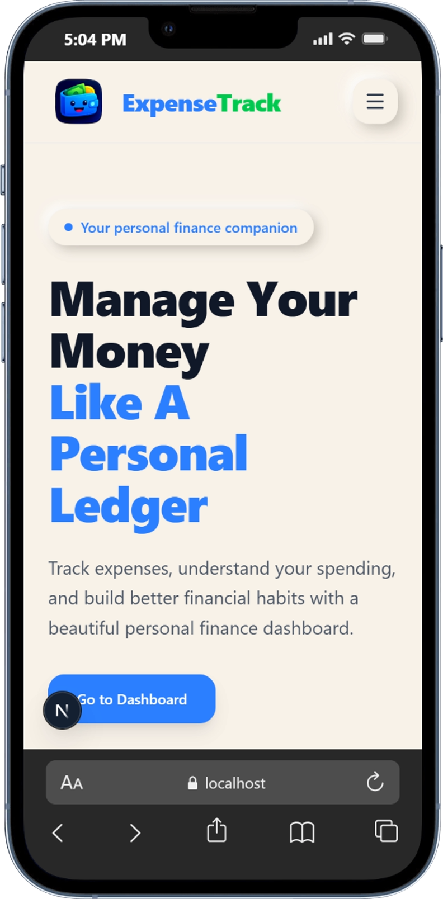
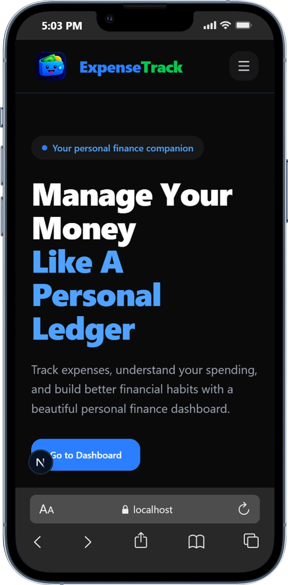

# 💰 ExpenseTrack

A modern personal finance and expense management application built with **Next.js**. ExpenseTrack helps users track their expenses, understand their spending habits, and manage their personal finances through a clean and responsive dashboard.

The application includes user authentication, expense management, spending statistics, interactive charts, light/dark themes, responsive design, and a modern finance-focused UI.

---

## ✨ Features

### 🔐 Authentication

- User registration
- User login
- User logout
- Authentication state management
- Protected user-specific expense data
- Cookie-based authentication
- Current user session endpoint

### 💸 Expense Management

- Add new expenses
- View all expenses
- Edit existing expenses
- Delete expenses
- Categorize expenses
- Add notes to expenses
- Track expense dates
- Display expenses in a clean card-based interface
- Animated expense cards
- Toast notifications for actions

### 📊 Financial Dashboard

- Total expense overview
- Total transaction count
- Current month spending
- Top spending category
- Recent expenses
- Category-based spending visualization
- Monthly spending visualization

### 📈 Charts & Analytics

- Spending by category pie/donut chart
- Monthly spending bar chart
- Responsive chart layouts
- Interactive chart tooltips
- Animated chart components

### 🎨 User Interface

- Modern personal finance design
- Responsive desktop and mobile layouts
- Light mode
- Dark mode
- Custom theme toggle
- Neumorphic-inspired visual elements
- Smooth animations
- Loading states
- Empty states
- Custom 404 page
- Custom loading page
- Responsive navigation bar

### 📱 Responsive Design

ExpenseTrack is designed to work across:

- Desktop computers
- Laptops
- Tablets
- Mobile devices

The layout adapts to different screen sizes while maintaining the same overall visual experience.

---

## 🛠️ Tech Stack

### Frontend

- [Next.js](https://nextjs.org/)
- React
- Tailwind CSS
- Lucide React
- Framer Motion
- Recharts
- Sonner

### Backend

- Next.js App Router API Routes
- MongoDB
- Mongoose
- JWT-based authentication
- HTTP-only authentication cookies

### Development

- JavaScript
- ESLint
- npm
- Next.js App Router

---

## 📂 Project Structure

```text
├── public/
│   └── logo.png
├── src/
│   ├── app/
│   │   ├── api/
│   │   │   ├── auth/
│   │   │   │   ├── login/
│   │   │   │   │   └── route.js
│   │   │   │   ├── logout/
│   │   │   │   │   └── route.js
│   │   │   │   ├── me/
│   │   │   │   │   └── route.js
│   │   │   │   └── register/
│   │   │   │       └── route.js
│   │   │   └── expenses/
│   │   │       ├── [id]/
│   │   │       │   └── route.js
│   │   │       ├── stats/
│   │   │       │   └── route.js
│   │   │       └── route.js
│   │   ├── dashboard/
│   │   │   └── page.jsx
│   │   ├── expenses/
│   │   │   ├── edit/
│   │   │   │   └── [id]/
│   │   │   │       └── page.jsx
│   │   │   └── new/
│   │   │       └── page.jsx
│   │   ├── login/
│   │   │   └── page.jsx
│   │   ├── register/
│   │   │   └── page.jsx
│   │   ├── globals.css
│   │   ├── icon.png
│   │   ├── layout.js
│   │   ├── loading.jsx
│   │   ├── not-found.jsx
│   │   └── page.js
│   ├── components/
│   │   ├── AnimatedCard.jsx
│   │   ├── AuthProvider.jsx
│   │   ├── DashboardHeader.jsx
│   │   ├── DashboardPreview.jsx
│   │   ├── EmptyState.jsx
│   │   ├── ExpenseCard.jsx
│   │   ├── ExpenseChart.jsx
│   │   ├── ExpenseList.jsx
│   │   ├── Loading.jsx
│   │   ├── LogoutButton.jsx
│   │   ├── MonthlyChart.jsx
│   │   ├── Navbar.jsx
│   │   ├── ProfileMenu.jsx
│   │   ├── SummaryCards.jsx
│   │   ├── ThemeProvider.jsx
│   │   └── ThemeToggle.jsx
│   ├── lib/
│   │   ├── auth.js
│   │   ├── jwt.js
│   │   └── mongodb.js
│   ├── models/
│   │   ├── Expense.js
│   │   └── User.js
│   └── proxy.js
├── eslint.config.mjs
├── jsconfig.json
├── next.config.mjs
├── package-lock.json
├── package.json
├── postcss.config.mjs
└── README.md

```

---

## 🚀 Getting Started

Follow the steps below to run ExpenseTrack locally.

### 1. Clone the repository

```bash
git clone https://github.com/aswink-dev/expense-track.git
```

Navigate into the project:

```bash
cd expense-track
```

---

### 2. Install dependencies

Using npm:

```bash
npm install
```

---

### 3. Configure environment variables

Create a `.env.local` file in the root directory:

```text
expense-track/
├── .env.local
├── package.json
└── ...
```

Add your environment variables:

```env
MONGODB_URI=your_mongodb_connection_string
JWT_SECRET=your_secure_jwt_secret
```

### Environment Variables

| Variable      | Description                                              |
| ------------- | -------------------------------------------------------- |
| `MONGODB_URI` | MongoDB database connection string                       |
| `JWT_SECRET`  | Secret key used to sign and verify authentication tokens |

> Never commit `.env.local` or any file containing secrets to GitHub.

Make sure your `.gitignore` includes:

```gitignore
.env
.env.local
.env.*.local
```

---

### 4. Start the development server

Run:

```bash
npm run dev
```


## 📜 Available Scripts

### Development

```bash
npm run dev
```

Starts the Next.js development server.

### Production Build

```bash
npm run build
```

Creates an optimized production build.

### Production Server

```bash
npm run start
```

Starts the application in production mode.

### Lint

```bash
npm run lint

```


## 🔑 Authentication Flow

ExpenseTrack uses a cookie-based authentication system.

The general authentication flow is:

```text
User
 │
 ├── Register
 │      │
 │      ▼
 │   User created
 │
 ├── Login
 │      │
 │      ▼
 │   Authentication token
 │      │
 │      ▼
 │   HTTP-only cookie
 │
 └── Authenticated requests
        │
        ▼
      API
        │
        ▼
   User-specific data
```


## 📸 Screenshots


### Home Page

<p align="center">
  
  
</p>

### Dashboard

<p align="center">
  
  
</p>

### Mobile Responsive Design

<p align="center">
  
  
</p>

```


## 🧑‍💻 Development

To contribute to the project:

1. Fork the repository
2. Clone your fork
3. Create a new branch

```bash
git checkout -b feature/your-feature
```

4. Install dependencies

```bash
npm install
```

5. Start the development server

```bash
npm run dev
```

6. Make your changes
7. Test your changes
8. Commit your changes

```bash
git add .
git commit -m "Add your feature"
```

9. Push your branch

```bash
git push origin feature/your-feature
```

10. Open a Pull Request

---

## 📄 License

This project is currently available for personal and educational use.


---

## 👨‍💻 Author

**Aswin K**

Built with Next.js, React, MongoDB, and Tailwind CSS.

**ExpenseTrack** — Manage your money like a personal ledger.

---

## ⭐ Support

If you find this project useful, consider giving the repository a ⭐ on GitHub.

For bugs, suggestions, or feature requests, open an issue in the repository.

---

## 🔮 Future Improvements

Possible future improvements include:

- Budget limits
- Budget alerts
- Recurring expenses
- Income tracking
- Savings goals
- Advanced financial reports
- Export expenses to CSV
- Export expenses to PDF
- Date-range filtering
- Expense search
- Expense sorting
- Pagination
- More detailed analytics
- User profile management
- Password reset
- Email verification
- Social authentication
- Progressive Web App support
- Improved accessibility
- Automated testing
- Unit and integration tests

---

## 💰 ExpenseTrack

> Track your expenses. Understand your spending. Build better financial habits.
